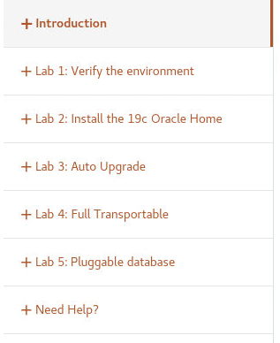

# Introduction #

## Introduction ##

**23ai Database** is the next long-term release version after the current long-term release version 19c. It will be supported for at least 5 years after the initial release of your platform. After this, Extended support and Sustaining support will be available. This hands-on workshop focuses on **Upgrading your environment to 23ai** demonstrating three scenarios that you can use (both on-premises and in the cloud) to upgrade your environment to 23ai in a Container/Multitenant setup.

This hands-on lab can be run stand-alone, but be aware that individual steps might take time to complete. Usually, the hands-on lab is delivered as part of the PTS 23ai Upgrade Workshop, which uses the time you need to wait with explanations and information.

Estimated time: 3 hours.

### Objectives ###

- Learn to install a new Oracle 23ai Home
- Upgrade databases by using the AutoUpgrade tool
- Upgrade a pluggable database using Replay Upgrade
- Upgrade a database using Full Transportable tablespaces

### Prerequisites ###

- A provisioned LiveLabs Environment
    - On the Attendee Page, you should see the NoVNC URL
The labs have been set up to work with a NoVNC remote desktop environment using an HTML5-compatible browser. This setup will work with most proxy systems.
- If you want to run (parts) of the workshop using a direct SSH connection, you need direct access to the Internet or a proxy that supports tunnelling.
    - Labs 3-5 can be run using SSH only
    - The setup of SSH for your keys (password authentication is not allowed) is not described in the lab.

## Task 1: Access the labs ##

- Use **Lab Contents** menu on the left side of the screen to access the labs.
    - If the menu is not displayed, click the menu button  on the top left to make it visible.

- From the menu, click on the lab that you would like to run. For example, if you want to proceed to **Lab 1**, click **Lab 1: Install a new Oracle Home**.

     

- You may close the menu by clicking the   again.

You may now **proceed to the next lab**.

## Acknowledgements ##

- **Author** - Robert Pastijn, Database Product Management, PTS EMEA - July 2024
