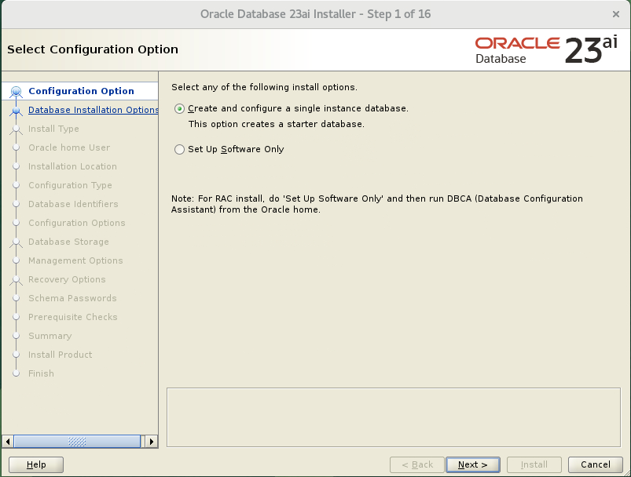
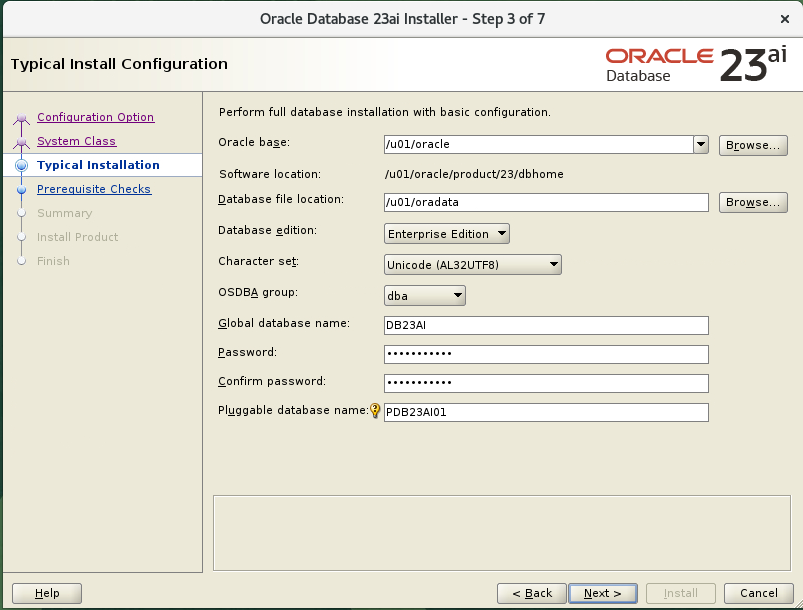
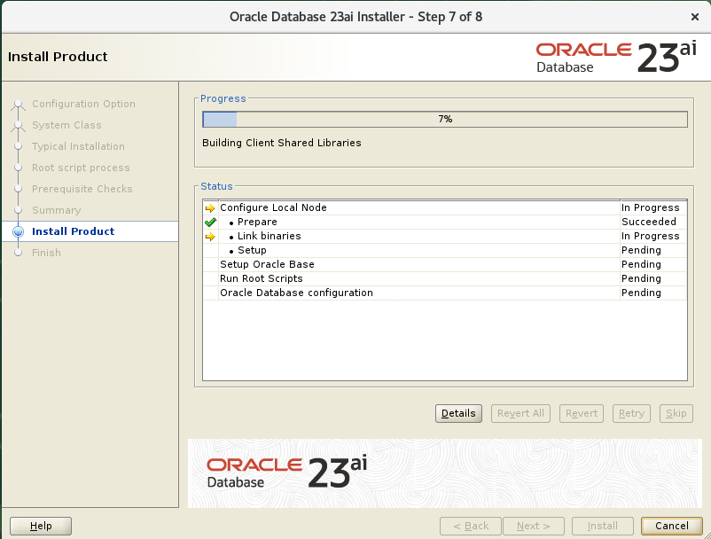
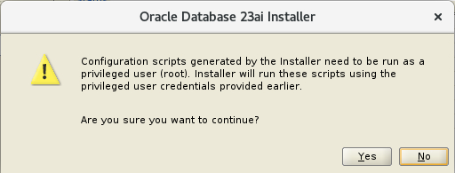
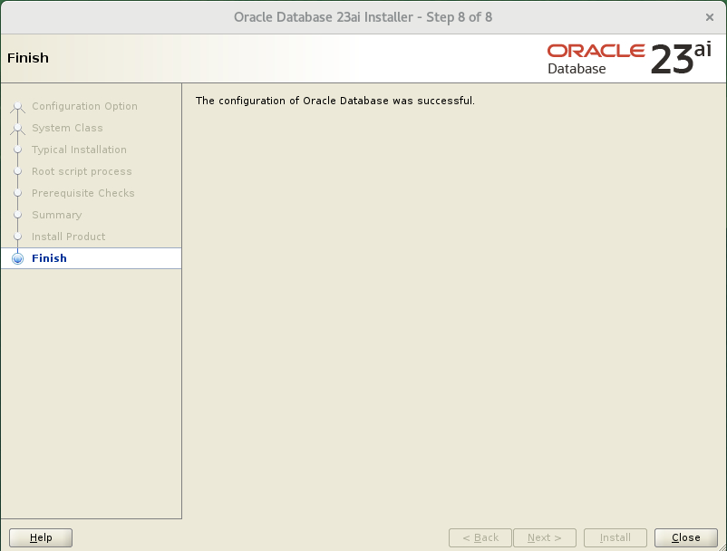

# Install a new 23ai database #

## Introduction ##

In this lab, we will install the 23ai database software and create a new 23ai database (and listener) as a target for the other upgrades.

Estimated Time: 30 minutes

### Objectives ###

In this lab, you will

- Learn how to install and register a new Oracle 23ai Home in the location of your choice
- Install the Oracle 23ai preinstall package
- Create a new Oracle 23ai Container Database (CDB) with a pluggable database (PDB)
- Reduce the memory footprint of the new 23ai instance
- Install the latest autoupgrade.jar in the Oracle 23ai Home

### Prerequisites ###

- You have access to the Upgrade to a 23ai Hands-on-Lab Livelabs environment
- You have connected to the Hands-on-Lab Livelabs environment using the NoVNC link from the Livelabs reservation

## Task 1: prepare 23ai software and operating system ##

 Before we can upgrade to Oracle 23ai, we need to have the Oracle software installed. Outside of this training environment, you should download the production software base release from [https://eDelivery.oracle.com](https://eDelivery.oracle.com "eDelivery.oracle.com"). In a production environment, please also download the patches required and apply them before you create or upgrade any instances. The DBA can download patches to patch the base 23ai version (23.5.0) from [https://support.oracle.com](https://support.oracle.com).

 We have already downloaded the software for you in this workshop. You need to adhere to the Oracle license restrictions when using this software. For training purposes when using this Hands-On Lab, the Oracle Technology Network license will apply. All required software is available in the `/source` directory in your image.

### Install the 19c pre-install RPM on the system ###

An easy way to make sure all system parameters are correct in a Linux environment is to use the preinstall rpm package. For non-Linux environments, please check the manual for the appropriate environment values. We have already downloaded the preinstall rpm in the environment, so you can simply install it.

1. Run the installer to start the database software install. The user executing the command should be then 'oracle' user.

    ```text
    $ <copy>sudo dnf -y localinstall /source/oracle-database-preinstall-23ai-1.0-1.4.el8.x86_64.rpm </copy>

    Last metadata expiration check: 0:45:18 ago on Tue 18 Jun 2024 07:31:10 AM GMT.
    Dependencies resolved.
    ============================================================================================================================================================
 Package                                              Architecture                Version                           Repository                         Size
=================================================================	===========================================================================================
Installing:
 oracle-database-preinstall-23ai                      x86_64                      1.0-1.4.el8                       @commandline                       31 k
     replacing  oracle-database-preinstall-23c.x86_64 1.0-1.el8

    Transaction Summary
    ============================================================================================================================================================
    Install  1 Package

    Total size: 31 k
    Downloading Packages:
    Running transaction check
    Transaction check succeeded.
    Running transaction test
    Transaction test succeeded.
    Running transaction
      Preparing        :                                                                1/1 
      Installing       : oracle-database-preinstall-23ai-1.0-1.4.el8.x86_64                 2/2 
      Running scriptlet: oracle-database-preinstall-23ai-1.0-1.4.el8.x86_64                 2/2 
      Verifying        : oracle-database-preinstall-23ai-1.0-1.4.el8.x86_64                 2/2 

    Installed:
      oracle-database-preinstall-23ai-1.0-1.4.el8.x86_64                                                                                                        

    Complete!
    ```

### Locate 23ai software and unzip in the correct location ###

 The software downloaded from the Oracle network is a zip file for your operating system/architecture. In 23ai, the location where you unzip the software and start the Oracle Universal Installer (OUI) **will be used as your new Oracle Home**, so be careful where you unzip the software. Running the OUI will only register the software with the inventory (or create an inventory if none exists), not copy the software to that location.

2. First, we need to create a new location for the software. Execute the following command as an oracle user after starting a new terminal window in your image:

    ```text
    $ <copy>mkdir -p /u01/oracle/product/23/dbhome</copy>
    ```

3. We can now use this new location to unzip our software.

    ```text
    $ <copy>cd /u01/oracle/product/23/dbhome</copy>
    ```

    ```text
    $ <copy>unzip /source/240612_dbhome.zip</copy>
    ```
    ```text
    ...
      python/bin/python      -> python3
      python/bin/python3     -> python3.12
      python/bin/python3-config -> python3.12-config 
      python/lib/libcrypto.so -> libcrypto.so.3
      python/lib/libffi.so   -> libffi.so.8.1.2
      python/lib/libffi.so.8 -> libffi.so.8.1.2
      python/lib/libpython3.12.so -> libpython3.12.so.1.0
      python/lib/libsqlite3.so -> libsqlite3.so.0.8.6
      python/lib/libsqlite3.so.0 -> libsqlite3.so.0.8.6
      python/lib/libssl.so   -> libssl.so.3
      python/lib/libz.so     -> libz.so.1.3.1
      python/lib/libz.so.1   -> libz.so.1.3.1
      python/lib/pkgconfig/python3-embed.pc -> python-3.12-embed.pc
      python/lib/pkgconfig/python3.pc -> python-3.12.pc
      
      [oracle@23ai-upgrade:/u01/oracle/product/23/dbhome]$
    ```

We will not install any patches during this workshop; therefore, we can continue to prepare the operating system environment.


## Task 2: run OUI and create new 23ai database ##

 Before using the unzipped Oracle software, we need to run the Oracle Universal Installer (OUI) to register the software to the Oracle Inventory on the system and do mandatory (relinking) steps for this OS. This can either be done in a GUI mode or in a character mode (for systems that do not have access to a graphical interface). In this lab, we will run the OUI in GUI mode for learning purposes.

### Run OUI ###

 While running the OUI, we have the option to install only the software (so no database) or to install the software and create a database. For various reasons, we will both install the software and create a new database in this lab.

 1. Execute the following commands in your terminal window as oracle user:

    ```text
    $ <copy>cd /u01/oracle/product/23/dbhome</copy>
    ```
    ```text
    $ <copy>./runInstaller &</copy>
    ```

    The following screen should be visible on your (remote) desktop:

    

    - Keep the default 'Create and Configure a single instance database' and press `NEXT`

2. In the next screen, choose 'Desktop class' and press `NEXT`

    The desktop-class will display one screen with all of the information required to create this type of database. If you think you need (for your local environment) other settings than displayed on the Desktop class screen, feel free to use the Server class. If you choose the Server class, please check the documentation for the values to be used. 

    For the Oracle provided Workshop environment, we will use the Desktop class.
    
3. Make sure to check and change the following values in the various fields:

    - Oracle Base
        - /u01/oracle (no changes)
    - Database File Location
        - /u01/oradata **(change this value)**
    - Database Edition
        - Enterprise Edition (no changes)
    - Characterset
        - Unicode (no changes)
    - OSBDA group
        - dba (no changes)
    - Global Database name
        - DB23AI **(change this value)**
    - Password
        - Welcome_123 **(change this value)**
    - Create as Container database
        - Checked (no changes)
    - Pluggable database name
        - PDB23AI01 **(change this value)**

    

    - After you have entered the correct values, please press the `NEXT` button to continue.

4.  Like previous installations, the `root.sh` script needs to be executed after the relinking and registration of the Oracle Home. This screen lets you decide whether or not you want the OUI to do this for you. In this workshop environment, you can use the sudo option for the automatic execution of the root.sh script(s). For your local environment (at home), do what applies to your situation.

    - Check the option to execute the configuration scripts automatically
        - Select the 'Use sudo' radio button
        - Change the command to execute to `/usr/bin/sudo`
        - Enter *any* password in the Password field.
            - Please note the screen will display an error if you do not supply a (random) Password

 The following screen should be visible:

    
    
    - Click the 'Next' button to continue.

 5. The system will now start checking the prerequisites for the 23ai installation.

 6. If all prerequisites have been checked and the preparation check can find no warnings or errors, the OUI will display the summary screen:

    

    - Press the `Install` button to start the installation and database creation.

    

 7. After about 3 minutes, provided there are no issues during the installation, the root.sh script needs to be executed. If you have entered the password for the root user in the OUI, the pop-up box will ask permission to execute the scripts:

    

    - Click the `Yes` button to continue

    > If you did not provide a root password or sudo information, a different window will be displayed.
    >
    > 
    >
    > If you do not get the option to click `Yes`, please execute the script mentioned in the window as `root` user in a terminal environment.

8. The installer will now start to create the new CDB database with its PDB. This part of the installation will take about 10 minutes.
    
9. After the database creation has finished, the OUI will display the following screen (or similar):

    

    - Press the `Close` button to end the Universal Installer session.

    Your 23ai Oracle Home has been created, and the initial database (DB23AI) has been started.

## Task 3: change default memory parameters and perform administration ##

 The OUI takes a certain percentage of the available memory in our environment as default SGA size. In our workshop environment, this is an SGA of 18G. We need the memory for other tasks (databases) later on, so we will need to lower the memory usage of the new instance:

1. Please execute the following commands as `oracle` user to login to the database:

    ```text
    $ <copy>. oraenv</copy>
    
    ORACLE_SID = [oracle] ? <copy>DB23AI</copy>
    The Oracle base remains unchanged with value /u01/oracle
    ```
    
    ```text
    $ <copy>sqlplus / as sysdba</copy>

    SQL*Plus: Release 23.0.0.0.0 - Production on Wed Jun 19 06:30:10 2024
    Version 23.5.0.24.06

    Copyright (c) 1982, 2024, Oracle.  All rights reserved.


    Connected to:
    Oracle Database 23ai Enterprise Edition Release 23.0.0.0.0 - Production
    Version 23.5.0.24.06
    ```
    
2. Change the parameters for the memory setting to a lower value:

    ```text
    SQL> <copy>alter system set sga_max_size=3G scope=spfile;</copy>

    System altered.
    ```
    ```text
    SQL> <copy>alter system set sga_target=3G scope=spfile;</copy>

    System altered.
    ```
3. Shutdown and startup the database to get the parameters into effect:

    ```text
    SQL> <copy>shutdown immediate</copy>
    Database closed.
    Database dismounted.
    ORACLE instance shut down.
    ```
    ```text
    SQL> <copy>startup</copy>
    ORACLE instance started.

    Total System Global Area 3218669368 bytes
    Fixed Size                  5365560 bytes
    Variable Size             704643072 bytes
    Database Buffers         2499805184 bytes
    Redo Buffers	                8855552 bytes
    Database mounted.
    Database opened.
    ```

### Increase the size of tablespaces

Because upgrades and plugging in new PDBs will take space in certain tablespaces, the tablespaces will grown. Growing tablespaces takes time so it will be faster to increase the size of the existing tablespaces before we start the upgrade.

4. Increase the SYSAUX, SYSTEM, and UNDOTBS for the CDB:

    ```text
    <copy>ALTER DATABASE DATAFILE '/u01/oradata/DB23AI/sysaux01.dbf' resize 1500M;
    ALTER DATABASE DATAFILE '/u01/oradata/DB23AI/sysaux01.dbf' AUTOEXTEND ON
       NEXT 100M MAXSIZE UNLIMITED;
    ALTER DATABASE DATAFILE '/u01/oradata/DB23AI/system01.dbf' resize 1500M;
    ALTER DATABASE DATAFILE '/u01/oradata/DB23AI/system01.dbf' AUTOEXTEND ON
       NEXT 100M MAXSIZE UNLIMITED;
    ALTER DATABASE DATAFILE '/u01/oradata/DB23AI/undotbs01.dbf' resize 500M;
    ALTER DATABASE DATAFILE '/u01/oradata/DB23AI/undotbs01.dbf' AUTOEXTEND ON
       NEXT 100M MAXSIZE UNLIMITED;
       
    </copy>
    
    Database altered.
    
    Database altered.
    
    Database altered.
    
    Database altered.
    
    Database altered.
    
    Database altered.
    ```
    
5. You can now exit SQL*Plus to make a final change on the operating system.

    ```text
    SQL> <copy>exit</copy>
    
    Disconnected from Oracle Database 23ai Enterprise Edition Release 23.0.0.0.0 - Production
    Version 23.5.0.24.06
    ```
    
6. If you shut down your Hands-On-Lab environment, you will need to start the databases again. To make this automatic (using the default dbstart tool), execute the following command:

     ```text
     $ <copy>sudo sed -i 's/:N/:Y/' /etc/oratab</copy>
     ```

You may now proceed to the next lab.

## Acknowledgements ##

- **Author** - Robert Pastijn, Database Product Management, PTS EMEA - July 2024